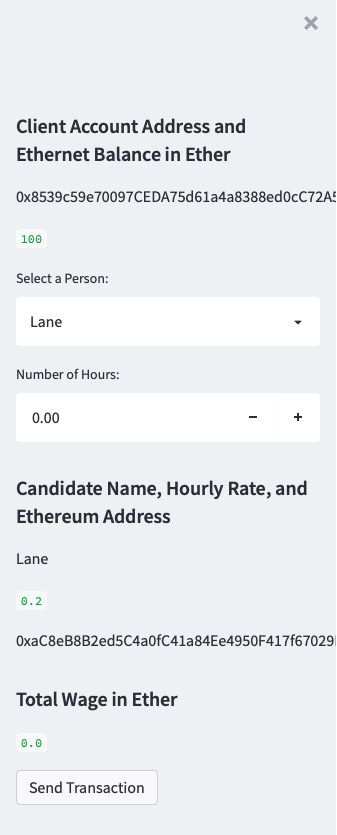
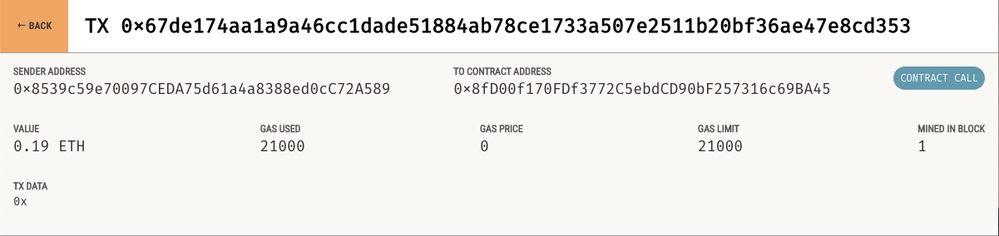

# FinTech Finder
---
## Description

The users can use this application to find a FinTech professional from a list of candidates, by integrating the Ethereum blockchain network into the application, it'll allow the user to instantly pay the FinTech professional whom they choose with Ethereum.

---
## Running the Application
Upon running the application:
* There will be a list of candidates with their respective picture, name, account address, their rate, and hourly rate. The following example shows the transaction with the front page:
    

* The sidebar contains:
  * The users client address and the Ethernet balance
  * Option to select the FinTech professional
  * Amount of hours the FinTech professional will work or worked
  * The confirmation of transaction, along with the button to submit the transaction.

* After submitting the transaction you will get a confirmation hash of the transaction, and you can check in Ganache for the confirmation hash.
  

---

## Contributors
Brought to you by Angel Reyes.